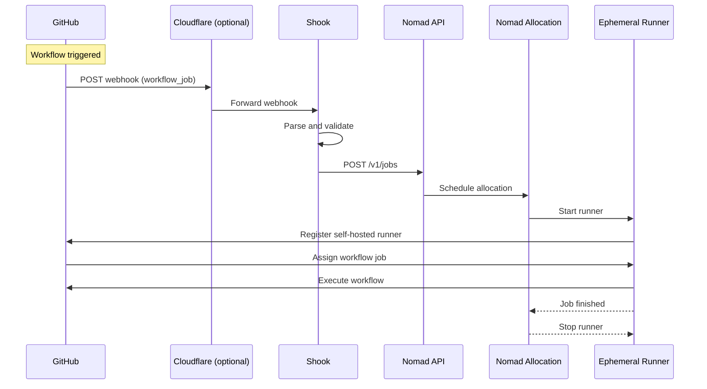

# Shook

```mermaid
sequenceDiagram
    participant GH as GitHub
    participant CF as Cloudflare (optional)
    participant SH as Shook
    participant NOM as Nomad API
    participant ALLOC as Nomad Allocation
    participant RUN as Ephemeral Runner

    Note over GH: Workflow triggered

    GH->>CF: POST webhook (workflow_job)
    CF->>SH: Forward webhook

    SH->>SH: Parse and validate

    SH->>NOM: POST /v1/jobs
    NOM->>ALLOC: Schedule allocation
    ALLOC->>RUN: Start runner

    RUN->>GH: Register self-hosted runner
    GH->>RUN: Assign workflow job

    RUN->>GH: Execute workflow
    RUN-->>ALLOC: Job finished
    ALLOC-->>RUN: Stop runner
```
