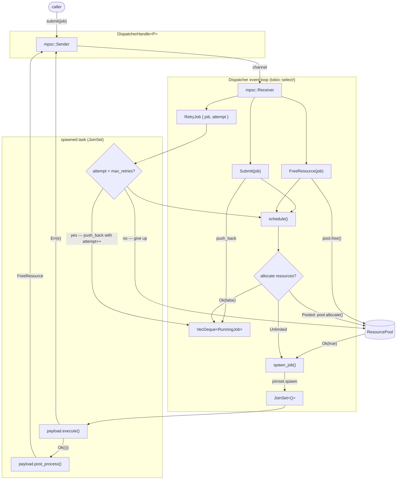

```mermaid
flowchart TD
    EXT(["caller"])

    subgraph handle["DispatcherHandle&lt;P&gt;"]
        TX["mpsc::Sender"]
    end

    subgraph loop["Dispatcher event loop  (tokio::select!)"]
        RX["mpsc::Receiver"]
        QUEUE["VecDeque&lt;RunningJob&gt;"]
        JOINSET["JoinSet&lt;()&gt;"]

        EV_SUBMIT["Submit(job)"]
        EV_FREE["FreeResource(job)"]
        EV_RETRY["RetryJob { job, attempt }"]

        SCHEDULE["schedule()"]
        ALLOC{"allocate resources?"}
        SPAWN["spawn_job()"]
    end

    subgraph worker["spawned task  (JoinSet)"]
        EXEC["payload.execute()"]
        OK_PATH["payload.post_process()"]
        ERR_PATH{"attempt &lt; max_retries?"}
    end

    POOL[("ResourcePool")]

    EXT -->|"submit(job)"| TX
    TX -->|channel| RX
    RX --> EV_SUBMIT
    RX --> EV_FREE
    RX --> EV_RETRY

    EV_SUBMIT -->|"push_back"| QUEUE
    EV_SUBMIT --> SCHEDULE

    EV_FREE -->|"pool.free()"| POOL
    EV_FREE --> SCHEDULE

    EV_RETRY --> ERR_PATH
    ERR_PATH -->|"yes — push_back with attempt++"| QUEUE
    ERR_PATH -->|"no — give up"| POOL
    ERR_PATH --> SCHEDULE

    SCHEDULE --> ALLOC
    ALLOC -->|"Pooled: pool.allocate()"| POOL
    POOL -->|"Ok(true)"| SPAWN
    ALLOC -->|"Unlimited"| SPAWN
    ALLOC -->|"Ok(false)"| QUEUE

    SPAWN -->|"joinset.spawn"| JOINSET
    JOINSET --> EXEC

    EXEC -->|"Ok(())"| OK_PATH
    OK_PATH -->|"FreeResource"| TX
    EXEC -->|"Err(e)"| TX
```